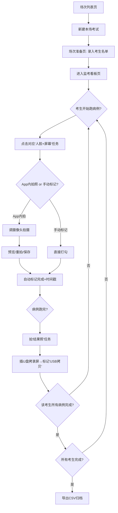

# 监考拍摄进度看板（ExamShot Tracker）PRD

## 1. 产品概述

- 监考拍摄进度看板是一款面向医疗模拟考试监考人员的**现场拍摄进度管理工具**，解决"7-8 台电脑同时运转、考生先后完成"高压场景下"漏拍 / 重复拍 / 分不清谁拍了没"的核心痛点。
- 监考员只需一部手机浏览器即可一眼掌握所有考生 × 所有病例的拍摄任务完成状态，支持 App 内调摄像头直接拍照，也兼容手动标记（用相机/另一台手机拍时打勾）。

## 2. 核心功能

### 2.1 用户角色

单一角色：监考员（无登录，纯本地使用，数据存手机）

### 2.2 功能模块

1. **场次列表页**：管理多场考试，新建 / 进入 / 归档 / 删除场次
2. **场次准备页**：录入考生名单、设置病例数量与命名、场次元信息（日期、地点、备注）
3. **监考看板页（核心）**：网格化展示所有考生 × 所有病例的拍摄进度，支持拍照 / 标记 / 查看照片 / 标注机位号
4. **拍照模态**：调用手机摄像头拍摄"人脸+屏幕照"或"结果照"，预览、重拍、保存
5. **导出与归档**：单场一键导出 CSV 完成情况，含每项任务的状态、时间戳、照片有无

### 2.3 页面详情

| 页面名称 | 模块名称 | 功能描述 |
|---------|---------|---------|
| 场次列表页 | 顶部状态栏 | 显示设备存储用量、今日场次数 |
| 场次列表页 | 场次卡片列表 | 每张卡片显示场次名/日期/考生数/完成率进度条，点击进入；右上角菜单可归档/删除/导出 |
| 场次列表页 | 新建场次按钮 | 弹出表单：场次名、日期、病例数（默认2）、病例命名（默认"病例1/病例2"） |
| 场次准备页 | 场次信息卡 | 显示/编辑场次名、日期、地点、备注、病例配置 |
| 场次准备页 | 考生名单编辑 | 批量录入（每行一个姓名/考号）、单条增删改、可标注机位号（1-8，可空） |
| 场次准备页 | 临时添加 | 监考中可随时从看板页快速追加考生（应对名单疏漏） |
| 场次准备页 | 开始监考按钮 | 进入看板页，按钮显示总任务数（考生数 × 病例数 × 3） |
| 监考看板页 | 全局状态条 | 显示完成率（如 12/42）、未完成数、漏拍预警数；快速跳转首个未完成项 |
| 监考看板页 | 考生进度卡（纵向滚动） | 每张卡：考生名/考号/机位号 + 横向2列病例块；每病例块3个任务按钮 |
| 监考看板页 | 任务按钮 | 三态：未做（红）/ 已做（绿，显示时间）；点击展开操作：拍照/手动标记/查看照片/取消标记 |
| 监考看板页 | 快速追加考生 | 顶部"+"按钮临时加人 |
| 拍照模态 | 摄像头预览 | 调用后置摄像头，显示取景框 + 任务说明（"拍人脸+屏幕"或"拍结果"） |
| 拍照模态 | 拍摄/重拍/保存 | 大快门按钮，拍完预览，可重拍或确认保存；保存后自动标记完成并记时间戳 |
| 导出页 | 完成情况表 | 表格列出每个考生每病例每任务的状态与时间 |
| 导出页 | 导出CSV | 下载 CSV 文件到手机 |

## 3. 核心流程

**监考员现场使用主流程**：考前在家/办公室用手机打开 App → 场次列表新建本场考试 → 录入考生名单（可标机位号）→ 进入看板页 → 考生陆续进场开始跑病例 → 监考员走动观察，看到某考生在跑病例1 → 打开对应任务按钮 → 拍"人脸+屏幕照"（或手动打勾）→ 该考生跑完病例1 → 拍"结果照" → 插U盘拷录屏后点"USB拷贝"标记完成 → 考生继续病例2，重复 → 全部完成后导出CSV归档。

**漏拍预警逻辑**：当某考生已标记"USB拷贝"完成但其前面的"人脸+屏幕照"或"结果照"未标记时，看板顶部状态条显示漏拍预警数，并可在该考生卡片上高亮缺失项。

## 4. 用户界面设计

### 4.1 设计风格

**设计方向：航空控制塔仪表盘（Mission Control）**

监考本质是"多目标并行任务监控"，类似空管监控多架飞机状态。采用深色仪表盘美学：高对比、等宽数字、网格化、状态色一眼可读。紧张场景下降低误操作。

- **主色调**：深炭灰背景 `#0a0e14`，卡片 `#161b22`，分隔线 `#21262d`
- **状态色**：完成 = 电光绿 `#39d353`；未做/待办 = 琥珀橙 `#f78166`；漏拍预警 = 警示红 `#ff6b6b`；进行中/中性 = 青蓝 `#58a6ff`
- **文字**：主文字 `#e6edf3`，次要 `#7d8590`
- **字体**：显示与数字用 `JetBrains Mono`（等宽，仪表盘感）；正文用 `Sora`（紧致现代，避开 Inter 俗套）
- **按钮风格**：大触控区（最小 44×44px），圆角 8px，状态色填充；任务按钮三态用色块+图标+时间戳
- **布局**：移动端单列纵向，考生卡纵向堆叠；每张卡内病例横向并列
- **图标**：使用简洁线性图标（Lucide），不用 emoji
- **动效**：状态切换时按钮色块短暂高亮脉冲；拍照成功时绿色勾闪现；新增考生时卡片滑入

### 4.2 页面设计概览

| 页面名称 | 模块名称 | UI 元素 |
|---------|---------|---------|
| 场次列表页 | 顶部栏 | 深色背景，左侧 App 标识（等宽字体"EXAMSHOT"），右侧存储用量小条 |
| 场次列表页 | 场次卡片 | 深灰卡，左上场次名+日期，右上完成率百分比（等宽大字），底部细进度条，右下角菜单按钮 |
| 场次列表页 | FAB新建 | 右下悬浮青蓝色圆形+号按钮 |
| 场次准备页 | 信息表单 | 深色卡片内深色输入框，标签等宽字体小号 |
| 场次准备页 | 考生列表 | 每行：序号(等宽) + 姓名输入 + 机位号输入(2位) + 删除按钮；底部"批量录入"折叠区 |
| 场次准备页 | 开始监考 | 底部固定大按钮，显示总任务数"开始监考 · 42 项任务" |
| 监考看板页 | 状态条 | 顶部固定：完成率"12/42"大等宽字 + 进度条 + 漏拍预警红色徽章 + 跳转按钮 |
| 监考看板页 | 考生卡 | 深灰卡，顶部：考生名+考号+机位号徽章；下方左右两列病例块 |
| 监考看板页 | 病例块 | 标题"病例1"，下方3个任务行：每行图标+任务名+状态色块+时间；点击展开操作面板 |
| 监考看板页 | 任务操作面板 | 弹出底部抽屉：拍照/手动标记/查看照片/取消；拍照按钮最大最显眼 |
| 拍照模态 | 全屏取景 | 黑色全屏，顶部任务说明+关闭，底部大快门按钮，左侧切换前后摄 |
| 导出页 | 完成表 | 深色表格，行交替深浅，状态用色块徽章 |
| 导出页 | 导出按钮 | 底部固定绿色大按钮"导出 CSV" |

### 4.3 响应式

**移动优先（手机浏览器为主用场景）**：
- 基准宽度 375px，最大内容宽度 480px 居中
- 所有可点击元素最小 44×44px 触控区
- 看板页纵向滚动，单手拇指可达
- 桌面端访问时居中显示手机宽度容器，两侧留深色背景（不强行铺满，保持仪表盘聚焦感）

### 4.4 3D 场景

不适用（纯 2D 工具应用）
