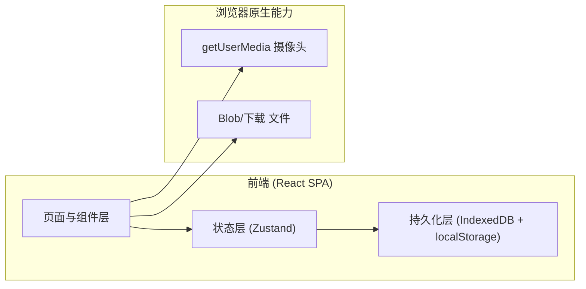
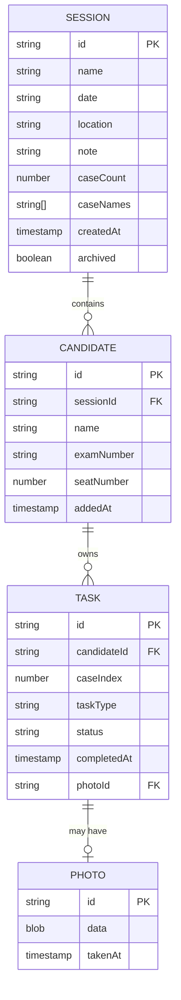

# 监考拍摄进度看板（ExamShot Tracker）技术架构

## 1. 架构设计

纯前端单页应用，无后端。所有数据存于浏览器本地（IndexedDB 存照片二进制 + localStorage 存元数据）。摄像头通过浏览器原生 `getUserMedia` API 调用。导出 CSV 通过 Blob + a 标签下载。



## 2. 技术说明

- **前端框架**：React 18 + Vite 5
- **样式**：TailwindCSS 3（深色仪表盘主题，自定义 CSS 变量）
- **路由**：react-router-dom 6
- **状态管理**：Zustand（轻量，配合 persist 中间件做 localStorage 持久化）
- **图标**：lucide-react
- **持久化**：
  - `localStorage`：场次列表、考生名单、任务状态元数据（轻量 JSON）
  - `IndexedDB`（通过原生 API 或 `idb` 库）：照片二进制 Blob（单张可能 1-3MB，不适合 localStorage）
- **摄像头**：原生 `navigator.mediaDevices.getUserMedia`，无需第三方库
- **字体**：JetBrains Mono + Sora（Google Fonts）
- **构建/初始化工具**：Vite `npm create vite@latest`
- **后端**：无
- **数据库**：无（纯浏览器本地）

## 3. 路由定义

| 路由 | 用途 |
|------|------|
| `/` | 场次列表页（首页） |
| `/sessions/new` | 新建场次（表单） |
| `/sessions/:id/setup` | 场次准备页（编辑名单/配置） |
| `/sessions/:id/board` | 监考看板页（核心） |
| `/sessions/:id/export` | 导出页（完成情况表 + CSV 下载） |

## 4. API 定义

无后端 API。前端通过 Zustand store 提供内部 action 接口：

```typescript
// store/sessionStore.ts 核心接口
interface SessionStore {
  sessions: Session[];
  createSession(input: SessionInput): string;        // 返回新 id
  updateSession(id: string, patch: Partial<Session>): void;
  deleteSession(id: string): void;
  addCandidate(sessionId: string, c: CandidateInput): string;
  updateCandidate(sessionId: string, cid: string, patch: Partial<Candidate>): void;
  removeCandidate(sessionId: string, cid: string): void;
  setTaskStatus(sessionId: string, candidateId: string, caseIndex: number, taskType: TaskType, status: TaskStatus, photoId?: string): void;
  getProgress(sessionId: string): { done: number; total: number; missing: number };
}
```

## 5. 服务器架构

不适用（纯前端无后端）

## 6. 数据模型

### 6.1 数据模型定义



### 6.2 数据定义语言（localStorage JSON 结构）

```typescript
// localStorage key: "examshot:sessions"
type SessionsState = {
  sessions: Session[];
};

type Session = {
  id: string;                  // uuid
  name: string;                // 场次名
  date: string;                // YYYY-MM-DD
  location?: string;
  note?: string;
  caseCount: number;           // 默认 2
  caseNames: string[];         // ["病例1", "病例2"]
  candidates: Candidate[];
  createdAt: number;           // timestamp
  archived: boolean;
};

type Candidate = {
  id: string;
  name: string;
  examNumber?: string;         // 考号
  seatNumber?: number;         // 机位号 1-8，可空
  addedAt: number;
  // 任务状态按 caseIndex × taskType 组织
  tasks: TaskRecord[];
};

type TaskRecord = {
  caseIndex: number;           // 0-based
  taskType: 'face_screen' | 'result' | 'usb_copy';
  status: 'pending' | 'done';
  completedAt?: number;
  photoId?: string;            // 指向 IndexedDB 中的照片
};

// IndexedDB 库名: examshot-db
// store: photos, keyPath: id
type PhotoRecord = {
  id: string;
  blob: Blob;
  takenAt: number;
  meta: { sessionId: string; candidateId: string; caseIndex: number; taskType: string };
};
```

### 6.3 漏拍预警算法

```typescript
// 对每个考生每个病例，若 usb_copy 已 done 但 face_screen 或 result 未 done → 计为漏拍
function countMissing(candidates: Candidate[]): number {
  let missing = 0;
  for (const c of candidates) {
    for (let i = 0; i < caseCount; i++) {
      const usb = getTask(c, i, 'usb_copy');
      const face = getTask(c, i, 'face_screen');
      const result = getTask(c, i, 'result');
      if (usb?.status === 'done' && (face?.status !== 'done' || result?.status !== 'done')) {
        missing++;
      }
    }
  }
  return missing;
}
```

## 7. 关键技术决策

1. **无后端**：用户场景是单机本地使用，有网但不依赖云端同步。纯前端最简部署（可静态托管或直接 `vite preview` 在手机同局域网访问），数据不外泄。
2. **照片存 IndexedDB**：单张手机拍摄照片常 1-3MB，localStorage 5MB 上限会爆。IndexedDB 容量大（数百 MB），适合存 Blob。
3. **元数据存 localStorage**：场次/考生/任务状态是小 JSON，频繁读写，放 localStorage 配合 Zustand persist 最简单。
4. **移动优先布局**：主用场景是手机浏览器，375px 基准宽度，桌面端居中显示窄容器。
5. **getUserMedia 要求 HTTPS 或 localhost**：部署时需 HTTPS（或手机访问开发机局域网 IP）。文档中提示用户。
